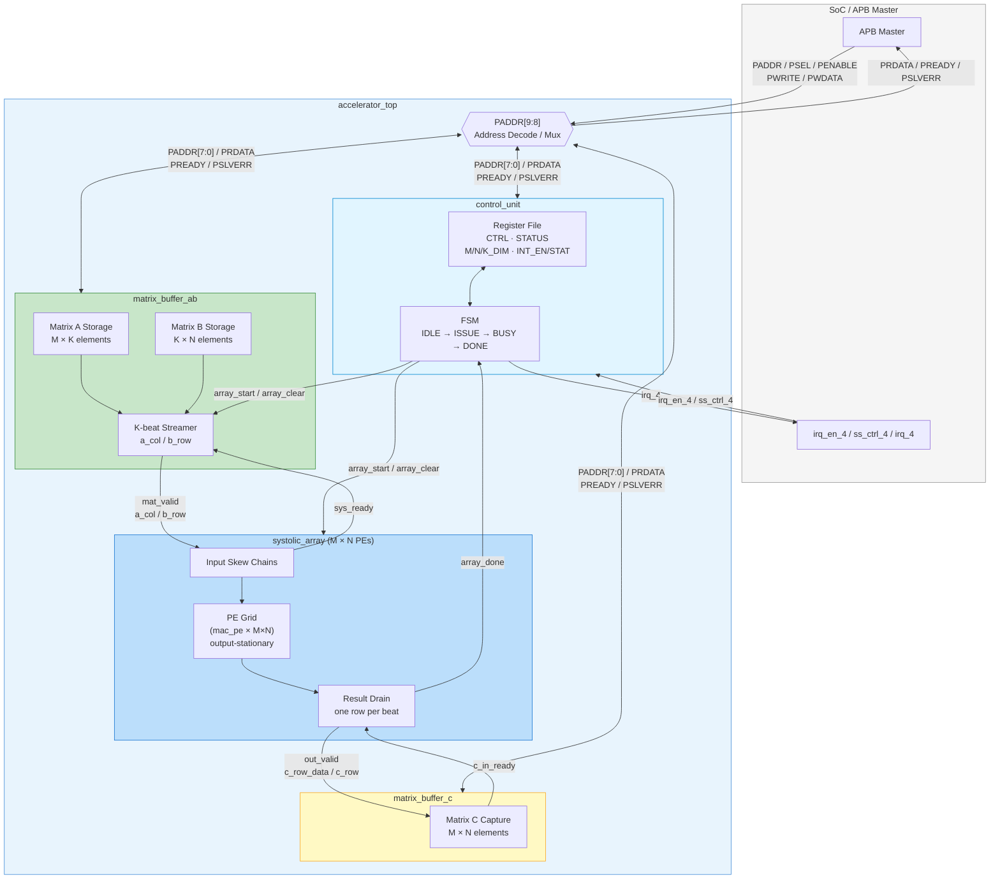

# AI Accelerator for Didactic SoC

A systolic-array (GEMM) AI accelerator for the
[Edu4Chip Didactic SoC](https://github.com/Edu4Chip/Didactic-SoC), with RTL
sources, Python/C golden models, cocotb + Verilator simulation, and full-SoC
(Ibex CPU in-loop) integration on the TUM lab server.

**New here?** Skim [Prerequisites](#prerequisites) → [Setup](#setup) →
[Run the tests locally](#run-the-tests-locally). That gets you to a green
`PASS` in a few minutes without any SoC, FPGA, or license.

For deeper material, `docs/` is the system of record — start at
[docs/README.md](docs/README.md) and [docs/ARCHITECTURE.md](docs/ARCHITECTURE.md).
Module pin/protocol contracts live in [docs/interface/](docs/interface/README.md).

## Table of contents

- [Prerequisites](#prerequisites)
- [Setup](#setup)
- [Run the tests locally](#run-the-tests-locally)
  - [1. Standalone accelerator sim (fastest)](#1-standalone-accelerator-sim-fastest)
  - [2. cocotb regression + coverage](#2-cocotb-regression--coverage)
  - [3. Full-SoC functional sim (CPU in-loop, Verilator)](#3-full-soc-functional-sim-cpu-in-loop-verilator)
- [Run on the lab server](#run-on-the-lab-server)
  - [One-time lab setup](#one-time-lab-setup)
  - [QuestaSim flow (CPU in-loop)](#questasim-flow-cpu-in-loop)
  - [FPGA flow (PYNQ-Z1)](#fpga-flow-pynq-z1)
- [Project layout](#project-layout)
- [Architecture at a glance](#architecture-at-a-glance)
- [Contributing (GitLab workflow)](#contributing-gitlab-workflow)
- [CI and pre-commit](#ci-and-pre-commit)
- [Troubleshooting](#troubleshooting)

## Prerequisites

Develop on **Linux** (on Windows, use WSL2). Only the first three rows are
needed for local simulation; the rest are for the full-SoC, lab-server, and
FPGA flows.

| Tool | Version | Needed for |
| --- | --- | --- |
| Python | 3.9 – 3.13 (**not 3.14** — cocotb doesn't support it yet) | tooling, cocotb, golden models |
| Verilator | **5.x** (built with `--timing`) | local RTL simulation |
| Git | any recent | clone + submodule |
| RISC-V GCC | baremetal `rv32imc/ilp32` (`riscv-none-elf-*` or `riscv64-unknown-elf-*`) | building Ibex firmware for full-SoC / FPGA |
| bender | 0.31.0 | fetching SoC RTL dependencies |
| QuestaSim | 2023.4 (lab server) | CPU-in-loop SoC sim (needs a Mentor license) |
| Vivado | 2024.1 (lab server) | FPGA bitstream (PYNQ-Z1) |

Install Verilator from your package manager:

```bash
sudo apt install verilator     # Debian/Ubuntu
sudo dnf install verilator     # Fedora
```

If your distro ships Verilator 4.x, build 5.x from source — the testbenches use
`--timing`, which 4.x lacks.

## Setup

```bash
# 1. Clone
git clone https://gitlab.lrz.de/ai-pro-msmcd-labs/2025/os/group5.git
cd group5

# 2. Python environment
python3 -m venv .venv
source .venv/bin/activate
pip install -r requirements.txt        # pulls in requirements/check.txt + sim.txt

# 3. (Recommended) install the pre-commit hooks
pre-commit install
```

That is everything you need for local simulation. The **full-SoC** and
**lab-server** flows additionally need the SoC submodule and `bender` — see
[One-time lab setup](#one-time-lab-setup).

## Run the tests locally

Three tiers, from fastest to most complete. Start with tier 1.

### 1. Standalone accelerator sim (fastest)

Self-contained SystemVerilog APB testbench
([sim/testbenches/accel/tb_accel.sv](sim/testbenches/accel/tb_accel.sv)) — no
SoC, no Ibex, no RISC-V program. Builds `accelerator_top` and prints `PASS`/`FAIL`.

```bash
source .venv/bin/activate
./sim/scripts/run_verilator.sh                         # int8_16x16 default
./sim/scripts/run_verilator.sh --variant int8_8x8      # PYNQ-Z1-friendly variant
./sim/scripts/run_verilator.sh --dim 8                 # legacy shorthand for 8x8
./sim/scripts/run_verilator.sh --list-variants         # show supported variants
./sim/scripts/run_verilator.sh --trace                 # also dump waves to sim/waves/
```

Expected: `All 256 C elements == 16, PASS` (or `All 64 C elements == 8, PASS`
with `--dim 8`).

### 2. cocotb regression + coverage

Every per-module cocotb testbench is driven by one pytest entry point. This is
the suite CI runs.

```bash
source .venv/bin/activate
pytest sim/test_runner.py -v
```

It runs the per-module testbenches under `sim/testbenches/` (array, control,
mac, matrix_ab, matrix_c, top) and then a functional-coverage report.

Coverage (Verilator `--coverage`) lands in:

- `sim/coverage_annotated/` — annotated RTL; lines prefixed `%00` never ran.
- `sim/coverage.info` — lcov format for the
  [Coverage Gutters](https://marketplace.visualstudio.com/items?itemName=ryanluker.vscode-coverage-gutters)
  VS Code extension (Command Palette → *Coverage Gutters: Display Coverage*).

Re-run just the report against existing `coverage.dat` files:

```bash
pytest sim/test_runner.py::test_coverage_report -v -s
```

Baseline (June 2026): **80 %** line coverage (269 / 334). The remaining gaps are
tied-zero `PSLVERR` ports and `unique case` FSM defaults that only fire on
illegal states — both intentional.

### 3. Full-SoC functional sim (CPU in-loop, Verilator)

The Ibex core executes `Didactic-SoC/sw/accel/accel.c`, which drives the
accelerator over the **real OBI/APB fabric** and self-checks `C = A·B` against a
golden reference. License-free (open-source Verilator). Needs the submodule and
its bender dependencies first ([One-time lab setup](#one-time-lab-setup) steps
1–3, runnable on any Linux box).

```bash
cd Didactic-SoC
make verilate_accel
```

**PASS** = the firmware writes `accel_result == 0xACCE5500`. Test vectors are
regenerable with `python3 sim/common/c_code/gen_accel_data.py --variant int8_16x16`.
Details and the
QuestaSim bring-up notes are in
[docs/verification/accelerator_soc_report.md](docs/verification/accelerator_soc_report.md).

## Run on the lab server

The CPU-in-loop QuestaSim and FPGA flows run on the TUM lab server
(`lx01.clients.eikon.tum.de`). The condensed steps are below; the full reference
(OpenOCD, licensing, board bring-up) is in
[docs/guides/lab_server_examples.md](docs/guides/lab_server_examples.md).

### One-time lab setup

Use the SoC **submodule pinned in this repo** — do not clone upstream
`Edu4Chip/Didactic-SoC` separately; the submodule already integrates the
accelerator into `tum_ss`.

```bash
# 1. Get the submodule (and its nested IPs)
git submodule update --init --recursive

# 2. Put bender (PULP dependency manager) on PATH
mkdir -p bin && cd bin
wget https://github.com/pulp-platform/bender/releases/download/v0.31.0/bender-0.31.0-x86_64-linux-gnu-ubuntu24.04.tar.gz
tar -xzf bender-0.31.0-*.tar.gz && rm bender-0.31.0-*.tar.gz
cd .. && export PATH="$PWD/bin:$PATH"

# 3. Fetch SoC RTL dependencies (ibex, obi, common_cells, ...)
cd Didactic-SoC && make repository_init
```

### QuestaSim flow (CPU in-loop)

One wrapper script does deps → baremetal build → compile → elaborate → run,
inside the lab apptainer container (QuestaSim is binary-incompatible with the
host Ubuntu 24.04):

```bash
# defaults TESTCASE=accel; defaults the TUM EI license and forwards it into the container
bash scripts/lab_server_sim.sh accel
```

PASS prints `accel: PASS` and `JTAG RETURN OK ... status 0x00000000`. Override
the license with `export LM_LICENSE_FILE=<port@host>` before running. The script
header documents every step it automates and how it differs from the official
`Edu4Chip_setup.sh`.

### FPGA flow (PYNQ-Z1)

Build a bitstream with Vivado, then load the program onto Ibex over JTAG
(FT4232H + OpenOCD).

```bash
# 1. Build the FPGA software image (riscv32 toolchain)
module load eda_freeware/riscv/64-elf-ubuntu-24.04-gcc/2026.04.05
cd Didactic-SoC/fpga/sw && make env && make test TESTCASE=accel   # -> build/fpga/sw/accel.elf

# 2. Synthesize + implement + bitstream (8x8 fits the PYNQ-Z1; default 16 overflows it)
module load xilinx/vivado/2024.1
cd Didactic-SoC/fpga && make all_xilinx ACCEL_VARIANT=int8_8x8
```

```bash
# 3. Program + run: OpenOCD in one terminal, GDB load in another
openocd -f Didactic-SoC/fpga/utils/openocd-didactic.cfg
cd Didactic-SoC/fpga && make load_elf TEST=accel    # in GDB: 'c' to run, Ctrl+C to halt
```

> Synthesis status (Vivado 2024.1 / `xc7z020`): the SoC synthesizes cleanly
> (0 DRC errors). At the **INT8 baseline** (`DEF_DATA_W = 8`) the **default 16x16
> array does not fit** the PYNQ-Z1 — now **LUT-bound** (110 % LUTs, &lt;1 % DSPs:
> 8-bit multiplies map to LUT fabric, leaving the 220 DSPs idle), whereas the
> former 16-bit datapath was DSP-bound. The **8x8 build fits** (54 % LUTs, 1 DSP)
> and produces `DidacticZ1.bit`. Board bring-up notes (FT4232H serial,
> `vid_pid 0x6011`, 25 MHz PLL, `z1.xdc` LED mapping) are in
> [docs/guides/lab_server_examples.md](docs/guides/lab_server_examples.md).

## Project layout

| Path | What |
| --- | --- |
| `rtl/` | SystemVerilog design (`MAC/`, `array/`, `matrix/`, `control/`, `top/`; shared params in `rtl/include/`). |
| `sim/testbenches/` | cocotb + Verilator testbenches, per module. |
| `sim/scripts/` | Standalone sim runners (`run_verilator.sh`, `run_xsim.sh`) + `Makefile.common`. |
| `sim/common/` | Shared Python helpers and golden/reference models (incl. `c_code/` GEMM model + vector generator). |
| `sw/` | C drivers/tests for the RISC-V Ibex core. |
| `fpga/`, `asic/` | FPGA constraints / Vivado project, and GF 22 nm FDX scripts/reports. |
| `scripts/` | CI convention/doc checkers and the QuestaSim lab-server runner. |
| `docs/` | **System of record** — index, architecture, interfaces, plans, guides, reference, verification. |
| `Didactic-SoC/` | Edu4Chip SoC submodule; the accelerator lives in its `tum_ss` slot. |

Full directory conventions: [docs/README.md](docs/README.md).

## Architecture at a glance

GEMM accelerator (`C = A·B`, output-stationary, default variant `int8_16x16`:
`M=N=K=16`, 8-bit signed inputs, 32-bit accumulate). The RISC-V core configures
and feeds it over APB:



The full domain/layer map, ownership, and a maturity scorecard are in
[docs/ARCHITECTURE.md](docs/ARCHITECTURE.md).

## Contributing (GitLab workflow)

Do not push to `main`. Work issue-by-issue on a branch and open a merge request:

1. Create or pick a GitLab issue.
2. Branch with an issue-linked name: `git checkout -b 2-mac-unit-pipeline-fix`.
3. Open an MR; link the issue in the description (`Closes #2`).
4. Get at least one approval before merging.

**Interface-first**: if you touch an RTL boundary (names, widths, reset,
handshake), update the matching `docs/interface/<module>_if.md` *first*. Track
complex, multi-step work as a plan in [docs/plans/](docs/plans/README.md). Full
workflow + CI-failure triage: [docs/guides/gitlab_workflow.md](docs/guides/gitlab_workflow.md).

## CI and pre-commit

GitLab CI (`.gitlab-ci.yml`) runs two stages:

- **check**: `scripts/check_conventions.py`, `ruff format --check .`,
  `scripts/check_gitkeep.py`, `scripts/check_docs.py` (docs structure /
  cross-links / freshness).
- **sim**: cocotb suite, the standalone accelerator Verilator test, and the
  full-SoC accelerator sim (guarded to RTL/SoC changes).

Run the same locally before pushing:

```bash
source .venv/bin/activate
pre-commit run --all-files          # ruff + conventions + gitkeep + docs
pytest sim/test_runner.py -v        # cocotb suite
./sim/scripts/run_verilator.sh      # standalone accelerator sim
```

## Troubleshooting

- **`python3` / `pip` missing** — install Python from your distro; re-create the
  venv (`python3 -m venv .venv`).
- **`verilator: not found` or 4.x** — install/build Verilator 5.x; the
  testbenches need `--timing`.
- **cocotb import/collection errors on Python 3.14** — use Python 3.9–3.13.
- **Full-SoC sim can't find SoC deps** — run
  [One-time lab setup](#one-time-lab-setup) steps 1–3 (`submodule update`,
  `bender`, `make repository_init`).
- **`vlib`/`vsim` not found in the container** — bind `/nfs` (QuestaSim lives
  under `/nfs/tools/...`); `scripts/lab_server_sim.sh` already does this.
- **A check fails** — read the first error line; it usually names the file and
  the fix.
