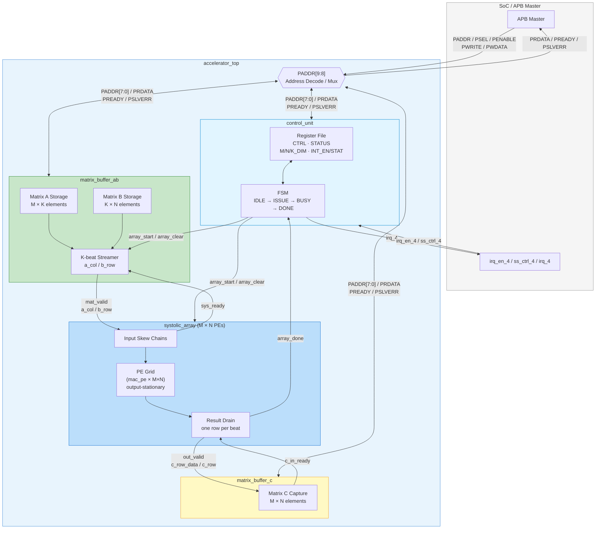

# AI Accelerator for Didactic SoC

This project implements a systolic-array based AI accelerator for the [Edu4Chip didactic SoC](https://github.com/Edu4Chip/Didactic-SoC) and includes RTL sources, Python golden models, cocotb testbenches, and Verilator-based simulation.

If you want the interface reference, see [docs/interface/README.md](docs/interface/README.md).

## Table of contents
- [Architecture Overview](#architecture-overview)
- [What lives where](#what-lives-where)
- [Development and Verification Flow](#development-and-verification-flow)
- [Before you start](#before-you-start)
- [Quick start](#quick-start)
  - [Clone the repository](#clone-the-repository)
  - [Create the Python environment](#create-the-python-environment)
- [Run locally](#run-locally)
- [GitLab workflow](#gitlab-workflow)
- [Running simulations and viewing coverage](#running-simulations-and-viewing-coverage)
  - [Functional RTL coverage](#functional-rtl-coverage)
  - [Current coverage baseline](#current-coverage-baseline)
- [Standalone accelerator simulation](#standalone-accelerator-simulation)
- [Full-SoC integration (Didactic SoC)](#full-soc-integration-didactic-soc)
  - [Lab-server prerequisites (one-time)](#lab-server-prerequisites-one-time)
  - [Simulation flow (QuestaSim, CPU in-loop)](#simulation-flow-questasim-cpu-in-loop)
  - [FPGA flow (PYNQ-Z1)](#fpga-flow-pynq-z1)
- [CI and pre-commit](#ci-and-pre-commit)
- [Troubleshooting](#troubleshooting)

## Architecture Overview
The ML accelerator architecture is divided into the following loosely-coupled functional blocks:
- **Control Logic**: Orchestrates data movement and computation (in `rtl/control/`).
- **MAC Unit**: The core Multiply-Accumulate processing element (in `rtl/MAC/`).
- **Systolic Array**: Grid of MAC units for matrix multiplication (in `rtl/array/`).
- **Matrix A & B**: Input distribution structures (in `rtl/matrix/`).
- **Matrix C**: Output accumulation and readback logic (in `rtl/matrix/`).

The integration target is the Edu4Chip SoC platform. Both ASIC (GF 22 nm FDX) and FPGA prototyping targets are maintained.



## What lives where
- `rtl/` contains the SystemVerilog design components (`MAC/`, `array/`, `matrix/`, `control/`, `top/`).
- `sim/testbenches/` contains the cocotb and Verilator test scripts categorized per module.
- `sim/scripts/` contains the standalone simulation runners (`run_verilator.sh`, `run_xsim.sh`) and the shared `Makefile.common`.
- `sim/common/` contains shared Python helpers and golden models.
- `docs/` contains documentation on the Didactic SoC, GitLab coordination, and interfaces.
- `fpga/` contains FPGA constraints and the Vivado project setup.
- `asic/` contains reports and scripts targeting the GF 22 nm FDX technology node.
- `sw/` contains C-based software drivers and tests for the RISC-V Ibex core interactions.
- `bin/` holds local tool binaries (e.g. `bender`); it is gitignored and not committed.
- `Didactic-SoC/` is the Edu4Chip SoC included as a git submodule; the accelerator is integrated into its `tum_ss` subsystem slot.

## Development and Verification Flow
Functionality changes require the following pipeline to be considered complete:
1. **RTL Design**: Implement the SystemVerilog design under `rtl/`. Sub-modules must adhere to the interface contracts defined in `docs/interface/`.
2. **Python Golden Model**: Author a software reference model matching the expected behavioral outputs under `sim/testbenches/` or `sim/common/`.
3. **Cocotb Testbench**: Develop Python-based testbenches utilizing cocotb to check DUT outputs against the golden model.
4. **Verilator Simulation**: Confirm that tests pass properly through Verilator in a Linux environment.
5. **CI Automation**: Assure every merge request natively passes in the automated CI jobs.

## Before you start
- Use Linux for development. If you are on Windows, use WSL or another Linux environment.
- Use Python 3.13 or an older supported Python 3 release. Python 3.14 is not supported yet because cocotb does not support it at the moment.
- Install Git, Python, and Verilator before running the simulations.

## Quick start
1. Clone the repository.
2. Create and activate a Python virtual environment.
3. Install the Python requirements.
4. Run the checks or the test suite.

### Clone the repository

```bash
git clone https://gitlab.lrz.de/ai-pro-msmcd-labs/2025/os/group5.git
cd group5
```

### Create the Python environment

```bash
python3 -m venv .venv
source .venv/bin/activate
pip install -r requirements.txt
```

If `python3` is not found, install Python from your Linux distribution first.

## Run locally
If Verilator is missing, install it with your package manager. On Debian or Ubuntu, for example:

```bash
sudo apt install verilator
```

On Fedora:

```bash
sudo dnf install verilator
```

## GitLab workflow
This project should not be pushed directly to the `main` branch. Create a branch for your work and open a merge request.

Recommended flow:
1. Create or pick a GitLab issue first.
2. Create a branch for that issue.
3. Open a merge request from that branch.
4. Ask at least one other user to approve the MR before merging.

Use the issue and MR linking guide in [docs/GITLAB_ISSUE_LINKING.md](docs/GITLAB_ISSUE_LINKING.md).

Recommended branch naming:

```bash
git checkout -b 2-mac-unit-pipeline-fix
```

This makes it easier for GitLab to link the branch to the related issue.

In the MR description, link the issue explicitly. A common pattern is:

```markdown
Closes #2
```

It is better to create the issue before the MR so the branch, discussion, and review all stay connected to one work item.

## Running simulations and viewing coverage

All cocotb testbenches are driven by a single pytest entry point:

```bash
source .venv/bin/activate
pytest sim/test_runner.py -v
```

This runs every per-module Makefile under `sim/testbenches/` (array, control, mac, matrix\_ab, matrix\_c, top) and then produces a functional coverage report.

### Functional RTL coverage

Verilator is invoked with `--coverage` (configured in `sim/scripts/Makefile.common`).
After all testbenches complete, `test_coverage_report` in `sim/test_runner.py` runs
`verilator_coverage` to:

- Print a summary line (`Total coverage (N/334)`) to the terminal.
- Write annotated RTL sources to `sim/coverage_annotated/` — lines prefixed with
  `%00` were never executed.
- Write `sim/coverage.info` in lcov format for the
  [Coverage Gutters](https://marketplace.visualstudio.com/items?itemName=ryanluker.vscode-coverage-gutters)
  VS Code extension.

To view coverage highlights in the editor:
1. Open any RTL file (e.g. `rtl/top/accelerator_top.sv`).
2. Open the Command Palette (`Ctrl+Shift+P`) → **Coverage Gutters: Display Coverage**.

Green gutter marks indicate executed lines; red marks indicate unexecuted lines.

Run only the coverage report (against existing `coverage.dat` files) without re-running simulations:

```bash
pytest sim/test_runner.py::test_coverage_report -v -s
```

### Current coverage baseline

As of June 2026 the aggregate line coverage across all RTL modules is **80 %** (269 / 334 lines).

| Module | Uncovered lines | Notes |
|---|---|---|
| `accelerator_top.sv` | 1 | `PSLVERR` (tied-zero, never asserted) |
| `control_unit.sv` | 2 | `unique case` FSM default branch (unreachable by design) |
| `matrix_buffer_ab.sv` | 2 | `unique case` FSM default + `PSLVERR` |
| `matrix_buffer_c.sv` | 1 | `PSLVERR` (tied-zero) |
| `systolic_array.sv` | 1 | `unique case` FSM default (unreachable by design) |

Remaining gaps are either ports tied to constant zero (`PSLVERR`) or `unique case` default
branches that require an illegal FSM state to fire. Both are intentional design constraints.

## Standalone accelerator simulation
Besides the cocotb suite, the accelerator can be exercised end-to-end through its APB
interface with a self-contained SystemVerilog testbench
([sim/testbenches/accel/tb_accel.sv](sim/testbenches/accel/tb_accel.sv)). This needs no SoC,
no Ibex core, and no RISC-V program.

```bash
# Verilator 5.x (with --timing). Builds accelerator_top + tb_accel and prints PASS/FAIL.
./sim/scripts/run_verilator.sh

# Optionally dump waves to sim/waves/
./sim/scripts/run_verilator.sh --trace
```

A Vivado/xsim runner is also provided for environments that have the Xilinx tools:

```bash
./sim/scripts/run_xsim.sh
```

## Full-SoC integration (Didactic SoC)
The accelerator is integrated into the Edu4Chip SoC (included as the `Didactic-SoC`
git submodule) in the `tum_ss` subsystem slot. The full SoC — Ibex core, all subsystems,
and the accelerator — builds and elaborates under the SoC's official Verilator flow:

```bash
cd Didactic-SoC
make verilate
```

This compiles the entire SoC (including the accelerator RTL) and runs the C++ testbench,
dumping waves to `Didactic-SoC/logs/vlt_dump.vcd`. It confirms the accelerator elaborates
and links inside the SoC, but it cannot run the Ibex CPU in-loop (see the boot-ROM note
below). For day-to-day functional verification of the accelerator, prefer the standalone
testbench in the previous section.

A baremetal self-checking GEMM test for the accelerator lives at
`Didactic-SoC/sw/accel/accel.c`. Building it requires a baremetal RISC-V toolchain
(`riscv-none-elf-gcc`, rv32imc/ilp32):

```bash
cd Didactic-SoC/sw
make PREFIX=riscv-none-elf TESTCASE=accel TEST=accel test   # -> ../build/sw/accel.hex
```

> Note: the Didactic SoC has no autonomous boot ROM — the Ibex boot address points into the
> control-register region, and the reference SystemVerilog testbench boots the core over JTAG
> (which Verilator cannot run because it uses SystemVerilog classes). Running `accel.c` on the
> CPU in-loop is therefore done with QuestaSim on the lab server (simulation flow below) or on
> the PYNQ-Z1 FPGA (FPGA flow below); the standalone testbench above fully verifies accelerator
> function locally.

### Lab-server prerequisites (one-time)
These flows run on the TUM lab server with the Didactic SoC included here as a submodule —
do **not** clone the upstream `Edu4Chip/Didactic-SoC` separately; the submodule is already
pinned to the fork that integrates the accelerator into `tum_ss`.

```bash
# 1. Get the submodule (and its nested IPs)
git submodule update --init --recursive

# 2. Provide bender (PULP dependency manager) on PATH
mkdir -p bin && cd bin
wget https://github.com/pulp-platform/bender/releases/download/v0.31.0/bender-0.31.0-x86_64-linux-gnu-ubuntu24.04.tar.gz
tar -xzf bender-0.31.0-*.tar.gz && rm bender-0.31.0-*.tar.gz
cd .. && export PATH="$PWD/bin:$PATH"

# 3. Fetch SoC RTL dependencies (ibex, obi, common_cells, ...)
cd Didactic-SoC && make repository_init
```

### Simulation flow (QuestaSim, CPU in-loop)
QuestaSim must run inside the lab apptainer container (binary incompatibility with Ubuntu
24.04). The container image is `/nas/ei/share/tools/apptainer/MSMCD/alma.sif`.

The lab uses *environment modules*, which a non-login shell does not auto-initialise. Source
the init script first, then load the toolchain and QuestaSim modules:

```bash
source /nas/ei/share/tools/environment_modules/4.5.1/init/bash
module load eda_freeware/riscv/64-elf-ubuntu-24.04-gcc/2026.04.05   # riscv64 gcc (baremetal)
module load mentor/questasim/2023.4                                 # vlog/vopt/vsim on PATH
```

Build the accelerator baremetal program. `XLEN=64` selects the lab's 64-bit multilib
toolchain; the code is still compiled as `rv32imc/ilp32`:

```bash
cd Didactic-SoC
make build_test XLEN=64 TESTCASE=accel TEST=accel      # -> build/sw/accel.hex
```

Compile, elaborate and run inside the container. Run `vlog/vopt/vsim` non-interactively with
`apptainer exec` (no GUI needed). The `/nfs` bind is required — QuestaSim lives under
`/nfs/tools/...`, so without it `vlib`/`vsim` are not found:

```bash
SIF=/nas/ei/share/tools/apptainer/MSMCD/alma.sif
apptainer exec --env PATH="$PATH" \
    --bind /nas:/nas --bind /nfs:/nfs --bind /data:/data --bind /tmp:/tmp --bind "$HOME:$HOME" \
    "$SIF" bash -c '
        cd Didactic-SoC/sim
        make compile
        make elaborate TESTCASE=accel
        make run_sim    TESTCASE=accel'   # Ibex boots accel.hex over JTAG
```

`vlog`/`vopt` (compile + elaborate) need no license and confirm the accelerator integrates and
elaborates cleanly inside the full SoC. `vsim` (`run_sim`) does need a Mentor/Siemens license:
export the lab's license server before entering the container and pass it through, e.g.
`export MGLS_LICENSE_FILE=<port@host>` and add `--env MGLS_LICENSE_FILE` to the `apptainer exec`
call.

To run a different program, change `TESTCASE`/`TEST` (e.g. `blink` to first sanity-check the
environment). Add `GUI=-gui` to `make run_sim` for the QuestaSim GUI.

### FPGA flow (PYNQ-Z1)
Builds the bitstream with Vivado, then loads the accelerator program onto the Ibex core over
JTAG (FT4232H + OpenOCD).

```bash
# 1. Build the FPGA software image (separate fpga/sw flow, riscv32 toolchain)
module load eda_freeware/riscv/64-elf-ubuntu-24.04-gcc/2026.04.05
cd Didactic-SoC/fpga/sw
make env
make test TESTCASE=accel                                # -> build/fpga/sw/accel.elf

# 2. Synthesize, implement and generate the bitstream (z1 = PYNQ-Z1)
module load xilinx/vivado/2024.1
cd Didactic-SoC/fpga
make all_xilinx                                         # batch; or 'make all_xilinx_gui'
```

Then program the board and run the core:

```bash
# Open the generated project and write the bitstream to the FPGA
#   build/fpga/z1/didactic-z1.xpr
# Wire the JTAG IO pins to the FT4232H module, then in a new terminal:
openocd -f Didactic-SoC/fpga/utils/openocd-didactic.cfg

# In another terminal, load and run the ELF on Ibex via GDB:
cd Didactic-SoC/fpga
make load_elf TEST=accel
#   in the GDB session: type 'c' + Enter to run, Ctrl+C to halt, 'quit' to exit
```

> Board bring-up notes (from the lab setup): the OpenOCD config needs the FT4232H serial
> number and `vid_pid 0x6011`; the PYNQ-Z1 PLL is configured for 25 MHz (UART examples must
> match); and `fpga/constraints/z1.xdc` maps two GPIOs to the board LEDs. These only matter
> for the FPGA flow, not for simulation.

## CI and pre-commit
This repository uses GitLab CI to check the code automatically. The CI pipeline currently runs:
- convention checks (`scripts/check_conventions.py`)
- `ruff format --check .`
- `.gitkeep` validation
- cocotb simulation through Verilator
- the standalone accelerator Verilator testbench (`sim/scripts/run_verilator.sh`)

Pre-commit hooks are also configured for local use. They run:
- `ruff format`
- `python scripts/check_conventions.py`
- `python scripts/check_gitkeep.py`

Install and enable pre-commit if you want the same checks before every commit:

```bash
pip install pre-commit
pre-commit install
```

Run it manually when needed:

```bash
pre-commit run --all-files
```

## Troubleshooting
- If `python3` or `pip` is missing, install Python from your Linux distribution.
- If the virtual environment does not activate, check that you are using a Linux shell.
- If Verilator is missing, install it before running the simulation tests.
- If a check fails, read the first error message first; it usually points to the real problem.
