# Accelerator Top-Level Interface

## 1. Overview

`accelerator_top` is the APB-visible subsystem wrapper that integrates the control unit, Matrix A/B buffer, systolic array, and Matrix C buffer behind a single subordinate port.

It does not implement matrix storage or compute itself. Instead, it routes software access to the correct internal block and wires the compute path as:

`control_unit` -> `matrix_buffer_ab` -> `systolic_array` -> `matrix_buffer_c`

## 2. Block Diagram

```mermaid
flowchart TB
   subgraph external[Top-level external ports]
      direction LR
      clk_in["clk_in"]
      reset_int["reset_int"]
      PADDR["PADDR"]
      PSEL["PSEL"]
      PENABLE["PENABLE"]
      PWRITE["PWRITE"]
      PWDATA["PWDATA"]
      PRDATA["PRDATA"]
      PREADY["PREADY"]
      PSLVERR["PSLVERR"]
      irq_en_4["irq_en_4"]
      ss_ctrl_4["ss_ctrl_4"]
      irq_4["irq_4"]
   end

   subgraph router[Top wrapper routing and unused v1 nets]
      direction LR
      prdata_mux["PRDATA mux"]
      pready_mux["PREADY mux"]
      pslverr_mux["PSLVERR mux"]
      cfg_export["cfg_m / cfg_n / cfg_k / soft_reset"]
      legacy_unused["matrix_a/b/c addr-ren/wen (unused)"]
      clear_unused["array_clear (unused in v1)"]
      mat_done_unused["mat_done (unused)"]
      capture_ready_unused["c_in_ready (unused)"]
      capture_full_unused["capture_full (unused)"]
      out_ready_high["out_ready tied high"]
   end

   subgraph ctrl[control_unit ports]
      direction TB
      ctrl_clk["clk_in"]
      ctrl_reset["reset_int"]
      ctrl_PADDR["PADDR"]
      ctrl_PSEL["PSEL"]
      ctrl_PENABLE["PENABLE"]
      ctrl_PWRITE["PWRITE"]
      ctrl_PWDATA["PWDATA"]
      ctrl_PRDATA["PRDATA"]
      ctrl_PREADY["PREADY"]
      ctrl_PSLVERR["PSLVERR"]
      ctrl_irq_en_4["irq_en_4"]
      ctrl_ss_ctrl_4["ss_ctrl_4"]
      ctrl_irq_4["irq_4"]
      ctrl_matrix_a_addr["matrix_a_addr"]
      ctrl_matrix_a_ren["matrix_a_ren"]
      ctrl_matrix_b_addr["matrix_b_addr"]
      ctrl_matrix_b_ren["matrix_b_ren"]
      ctrl_matrix_c_addr["matrix_c_addr"]
      ctrl_matrix_c_wen["matrix_c_wen"]
      ctrl_array_start["array_start"]
      ctrl_array_clear["array_clear"]
      ctrl_array_done["array_done"]
      ctrl_cfg_m_dim["cfg_m_dim"]
      ctrl_cfg_n_dim["cfg_n_dim"]
      ctrl_cfg_k_dim["cfg_k_dim"]
      ctrl_soft_reset["soft_reset"]
   end

   subgraph ab[matrix_buffer_ab ports]
      direction TB
      ab_clk["clk"]
      ab_rst_n["rst_n"]
      ab_PADDR["PADDR"]
      ab_PSEL["PSEL"]
      ab_PENABLE["PENABLE"]
      ab_PWRITE["PWRITE"]
      ab_PWDATA["PWDATA"]
      ab_PRDATA["PRDATA"]
      ab_PREADY["PREADY"]
      ab_PSLVERR["PSLVERR"]
      ab_mat_start["mat_start"]
      ab_mat_done["mat_done"]
      ab_mat_valid["mat_valid"]
      ab_sys_ready["sys_ready"]
      ab_a_col["a_col"]
      ab_b_row["b_row"]
   end

   subgraph array[systolic_array ports]
      direction TB
      array_clk["clk"]
      array_rst_n["rst_n"]
      array_start["start"]
      array_done["done"]
      array_in_valid["in_valid"]
      array_in_ready["in_ready"]
      array_a_col["a_col"]
      array_b_row["b_row"]
      array_out_valid["out_valid"]
      array_out_ready["out_ready"]
      array_c_data["c_data"]
      array_c_row["c_row"]
      array_c_col["c_col"]
   end

   subgraph cbuf[matrix_buffer_c ports]
      direction TB
      c_clk["clk"]
      c_rst_n["rst_n"]
      c_PADDR["PADDR"]
      c_PSEL["PSEL"]
      c_PENABLE["PENABLE"]
      c_PWRITE["PWRITE"]
      c_PWDATA["PWDATA"]
      c_PRDATA["PRDATA"]
      c_PREADY["PREADY"]
      c_PSLVERR["PSLVERR"]
      c_in_valid["c_in_valid"]
      c_in_ready["c_in_ready"]
      c_data_in["c_data_in"]
      c_row_in["c_row_in"]
      c_col_in["c_col_in"]
      c_capture_full["capture_full"]
   end

   clk_in --> ctrl_clk
   clk_in --> ab_clk
   clk_in --> array_clk
   clk_in --> c_clk

   reset_int --> ctrl_reset
   reset_int --> ab_rst_n
   reset_int --> array_rst_n
   reset_int --> c_rst_n

   PADDR --> ctrl_PADDR
   PADDR --> ab_PADDR
   PADDR --> c_PADDR
   PSEL --> ctrl_PSEL
   PSEL --> ab_PSEL
   PSEL --> c_PSEL
   PENABLE --> ctrl_PENABLE
   PENABLE --> ab_PENABLE
   PENABLE --> c_PENABLE
   PWRITE --> ctrl_PWRITE
   PWRITE --> ab_PWRITE
   PWRITE --> c_PWRITE
   PWDATA --> ctrl_PWDATA
   PWDATA --> ab_PWDATA
   PWDATA --> c_PWDATA

   ctrl_PRDATA --> prdata_mux
   ab_PRDATA --> prdata_mux
   c_PRDATA --> prdata_mux
   prdata_mux --> PRDATA

   ctrl_PREADY --> pready_mux
   ab_PREADY --> pready_mux
   c_PREADY --> pready_mux
   pready_mux --> PREADY

   ctrl_PSLVERR --> pslverr_mux
   ab_PSLVERR --> pslverr_mux
   c_PSLVERR --> pslverr_mux
   pslverr_mux --> PSLVERR

   irq_en_4 --> ctrl_irq_en_4
   ss_ctrl_4 --> ctrl_ss_ctrl_4
   ctrl_irq_4 --> irq_4

   ctrl_matrix_a_addr --> legacy_unused
   ctrl_matrix_a_ren --> legacy_unused
   ctrl_matrix_b_addr --> legacy_unused
   ctrl_matrix_b_ren --> legacy_unused
   ctrl_matrix_c_addr --> legacy_unused
   ctrl_matrix_c_wen --> legacy_unused

   ctrl_cfg_m_dim --> cfg_export
   ctrl_cfg_n_dim --> cfg_export
   ctrl_cfg_k_dim --> cfg_export
   ctrl_soft_reset --> cfg_export

   ctrl_array_start --> ab_mat_start
   ctrl_array_start --> array_start
   ctrl_array_clear --> clear_unused
   array_done --> ctrl_array_done

   ab_mat_valid --> array_in_valid
   array_in_ready --> ab_sys_ready
   ab_a_col --> array_a_col
   ab_b_row --> array_b_row

   array_out_valid --> c_in_valid
   array_c_data --> c_data_in
   array_c_row --> c_row_in
   array_c_col --> c_col_in
   c_in_ready --> capture_ready_unused
   c_capture_full --> capture_full_unused

   array_out_ready --> out_ready_high
   out_ready_high --> array_out_ready

   ab_mat_done --> mat_done_unused
   ab_mat_done -. completion pulse .-> clear_unused
```

## 3. Port-Level View

### 3.1 External Ports

| Port Name | Direction | Width | Connected block | Detailed behavior |
| --- | --- | --- | --- | --- |
| `clk_in` | Input | `1` | All internal blocks | Shared system clock for the control unit, both matrix buffers, and the systolic array. The top wrapper passes this clock straight through without gating. |
| `reset_int` | Input | `1` | All internal blocks | Active-high top-level reset from the SoC. The wrapper converts it to internal active-low `rst_n` and uses it to reset the submodules. |
| `PADDR` | Input | `APB_AW` | APB decode, all sub-blocks | APB address bus. `accelerator_top` uses `PADDR[9:8]` to choose the target sub-block, and each selected block performs its own local `PADDR[7:0]` decode. |
| `PSEL` | Input | `1` | APB decode, all sub-blocks | APB select for the top wrapper. It must be asserted for the transaction to reach any sub-block. |
| `PENABLE` | Input | `1` | APB sub-blocks | APB enable phase of the transfer. It is forwarded unchanged to the selected sub-block. |
| `PWRITE` | Input | `1` | APB sub-blocks | APB direction qualifier. `1` means write, `0` means read. Forwarded to the selected sub-block. |
| `PWDATA` | Input | `APB_DW` | APB sub-blocks | APB write data bus. Used when software writes control registers or matrix data registers. |
| `PRDATA` | Output | `APB_DW` | APB mux output | Read data returned from the selected sub-block. The top wrapper multiplexes `prdata_ab`, `prdata_ctrl`, and `prdata_c` based on `PADDR[9:8]`. |
| `PREADY` | Output | `1` | APB mux output | APB ready response. It is asserted when the selected sub-block is ready, or when `PSEL` is low. |
| `PSLVERR` | Output | `1` | APB mux output | APB error response. In v1 it is driven by the selected sub-block and is normally deasserted. |
| `irq_en_4` | Input | `1` | `control_unit` | SoC-level interrupt gate. The control unit combines this with its internal interrupt state to generate `irq_4`. |
| `ss_ctrl_4` | Input | `8` | `control_unit` | Reserved subsystem control word from the SoC. It is carried through the top wrapper to the control unit for future compatibility. |
| `irq_4` | Output | `1` | SoC interrupt output | Interrupt request sent back to the SoC. In the current implementation it reflects the control unit's done interrupt condition. |

Port-by-port summary:

- `clk_in` and `reset_int` are the only global structural signals; everything else is either APB control or interrupt plumbing.
- `PADDR`, `PSEL`, `PENABLE`, `PWRITE`, and `PWDATA` are the write/read control path into the chosen sub-block.
- `PRDATA`, `PREADY`, and `PSLVERR` are the return path from the selected sub-block through the top-level APB mux.
- `irq_en_4`, `ss_ctrl_4`, and `irq_4` are the SoC-facing sideband and interrupt signals that only touch the control unit.

### 3.2 Internal Interconnect

| Signal | Source | Sink | Description |
| --- | --- | --- | --- |
| `array_start` | `control_unit` | `matrix_buffer_ab`, `systolic_array` | One-cycle launch pulse for a tile |
| `array_clear` | `control_unit` | internal / compatibility path | Clear pulse aligned with `array_start` |
| `array_done` | `systolic_array` | `control_unit` | Completion pulse from the array |
| `mat_valid` | `matrix_buffer_ab` | `systolic_array` | Valid beat for `a_col` and `b_row` |
| `sys_ready` | `systolic_array` | `matrix_buffer_ab` | Consume-ready handshake for streamed inputs |
| `a_col` | `matrix_buffer_ab` | `systolic_array` | Packed A column vector |
| `b_row` | `matrix_buffer_ab` | `systolic_array` | Packed B row vector |
| `out_valid` | `systolic_array` | `matrix_buffer_c` | Valid C output element |
| `c_data`, `c_row`, `c_col` | `systolic_array` | `matrix_buffer_c` | Captured output element and indices |

## 4. Address Decode

`accelerator_top` decodes the top two APB address bits:

| PADDR[9:8] | Target block | Function |
| --- | --- | --- |
| `2'b00` | `matrix_buffer_ab` | Software writes Matrix A/B tiles and reads buffer status |
| `2'b01` | `control_unit` | Control registers, status, and interrupt state |
| `2'b10` | `matrix_buffer_c` | Software reads back captured Matrix C results |

Each sub-block keeps its own local `PADDR[7:0]` decode.

## 5. Compute Flow

1. Software programs Matrix A and Matrix B through `matrix_buffer_ab`.
2. Software writes the control register in `control_unit` to request a start.
3. `control_unit` asserts `array_start` and `array_clear`.
4. `matrix_buffer_ab` streams one `a_col` and one `b_row` per accepted beat.
5. `systolic_array` consumes the streamed inputs and produces `c_data` with row/column indices.
6. `matrix_buffer_c` captures the outputs in row-major order.
7. `systolic_array` asserts `array_done`, and `control_unit` raises `done` state and `irq_4` when enabled.

## 6. Notes

- In v1, `PREADY` is effectively driven by the selected sub-block or deasserted when no sub-block is selected.
- `out_ready` is tied high in the top level, so Matrix C capture is always ready in v1.
- The legacy address and enable outputs from `control_unit` are preserved for compatibility but are not used by `accelerator_top`.