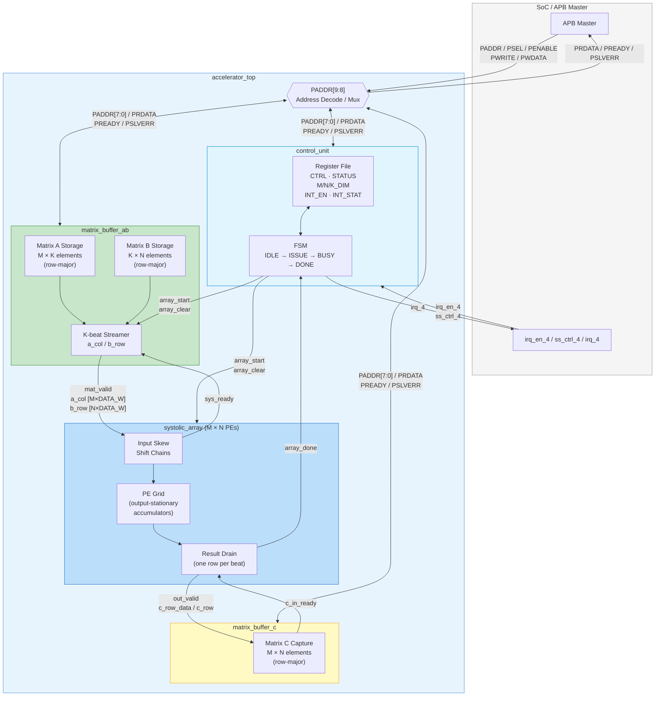
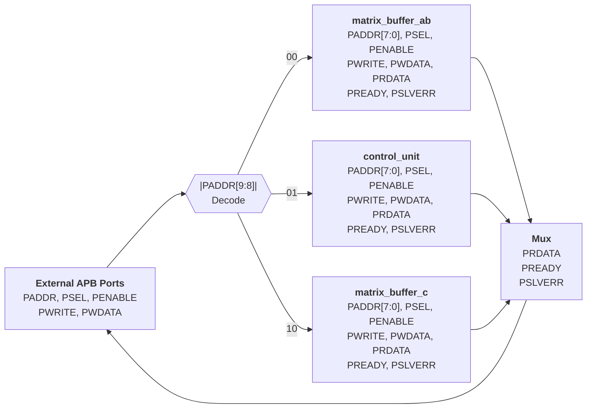
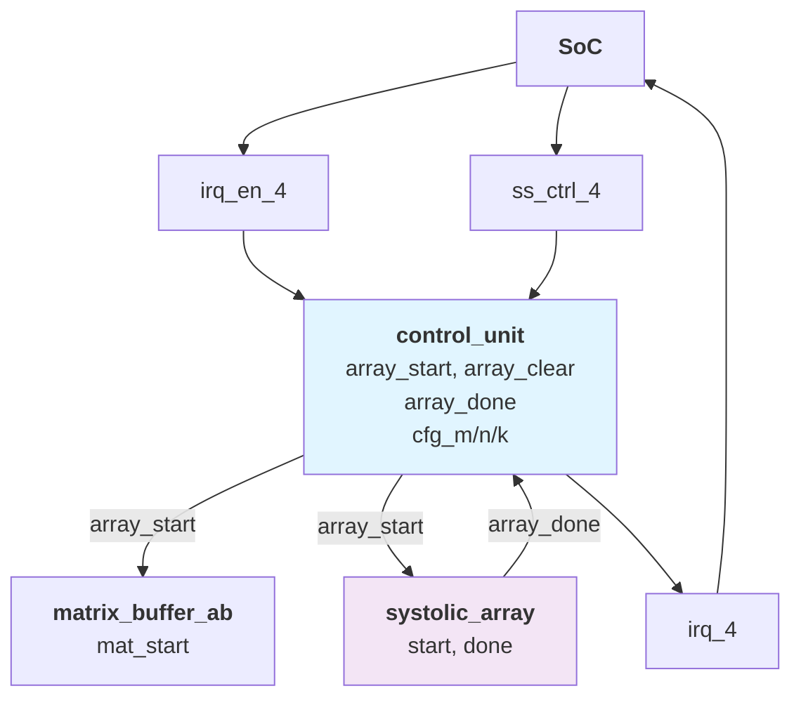
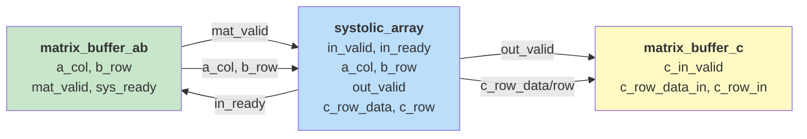
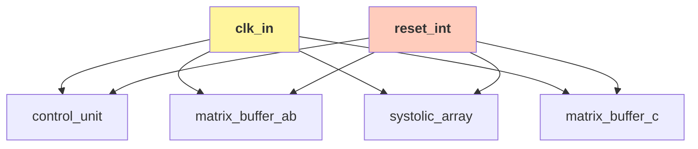

# Accelerator Top-Level Interface

> The subsystem wrapper. It presents one APB subordinate port to the SoC, routes
> each access to the right internal block, and wires the compute pipeline
> `control_unit → matrix_buffer_ab → systolic_array → matrix_buffer_c`.

- **Module:** `accelerator_top`
- **Source:** [`rtl/top/accelerator_top.sv`](../../rtl/top/accelerator_top.sv)
- **Owner:** shared

## Overview

`accelerator_top` integrates the [control unit](control_unit_if.md), the
[Matrix A/B buffer](matrix_buffer_a_b_if.md), the
[systolic array](systolic_array_if.md), and the
[Matrix C buffer](matrix_buffer_c_if.md) behind a single APB port. It implements no
storage or compute itself — it only decodes APB accesses to the correct sub-block
and connects the internal compute path.

## Block diagram

## Parameters

| Parameter | Default | Description |
| --- | --- | --- |
| `DATA_W` | `16` | Bit-width for Matrix A/B data elements. |
| `ACC_W` | `32` | Bit-width for Matrix C accumulation results. |
| `M` | `4` | Rows in the array and buffers. |
| `N` | `4` | Columns in the array and buffers. |
| `K` | `4` | Reduction-dimension length. |
| `APB_AW` | `10` | APB address width. |
| `APB_DW` | `32` | APB data width. |

## Ports

### External

| Port | Direction | Width | Description |
| --- | --- | --- | --- |
| `clk_in` | Input | `1` | Shared system clock for all sub-blocks; passed through ungated. |
| `reset_int` | Input | `1` | Active-high top-level reset; converted to internal active-low `rst_n`. |
| `PADDR` | Input | `APB_AW` | APB address. `PADDR[9:8]` selects the sub-block; each block decodes `PADDR[7:0]` locally. |
| `PSEL` | Input | `1` | APB select for the wrapper; must be high for any sub-block to be reached. |
| `PENABLE` | Input | `1` | APB enable phase; forwarded unchanged to the selected sub-block. |
| `PWRITE` | Input | `1` | APB direction (`1` = write, `0` = read); forwarded to the selected sub-block. |
| `PWDATA` | Input | `APB_DW` | APB write data for control or matrix-data registers. |
| `PRDATA` | Output | `APB_DW` | Read data, muxed from `prdata_ab` / `prdata_ctrl` / `prdata_c` per `PADDR[9:8]`. |
| `PREADY` | Output | `1` | APB ready; asserted when the selected sub-block is ready, or when `PSEL` is low. |
| `PSLVERR` | Output | `1` | APB error; driven by the selected sub-block, normally deasserted in v1. |
| `irq_en_4` | Input | `1` | SoC interrupt gate; combined with the control unit's interrupt state to form `irq_4`. |
| `ss_ctrl_4` | Input | `8` | Reserved SoC subsystem control word, carried to the control unit. |
| `irq_4` | Output | `1` | Interrupt back to the SoC; reflects the control unit's done-interrupt condition. |

Quick read:

- `clk_in` and `reset_int` are the only global structural signals.
- `PADDR`, `PSEL`, `PENABLE`, `PWRITE`, `PWDATA` are the path *into* the selected sub-block; `PRDATA`, `PREADY`, `PSLVERR` are the path back out through the mux.
- `irq_en_4`, `ss_ctrl_4`, `irq_4` are SoC sideband/interrupt signals that only touch the control unit.

### Internal interconnect

| Signal | Source | Sink | Description |
| --- | --- | --- | --- |
| `array_start` | `control_unit` | `matrix_buffer_ab`, `systolic_array` | One-cycle launch pulse for a tile. |
| `array_clear` | `control_unit` | internal / compatibility path | Clear pulse aligned with `array_start`. |
| `array_done` | `systolic_array` | `control_unit` | Completion pulse from the array. |
| `mat_valid` | `matrix_buffer_ab` | `systolic_array` | Valid beat for `a_col` and `b_row`. |
| `sys_ready` | `systolic_array` | `matrix_buffer_ab` | Consume-ready handshake for streamed inputs. |
| `a_col` | `matrix_buffer_ab` | `systolic_array` | Packed A column vector. |
| `b_row` | `matrix_buffer_ab` | `systolic_array` | Packed B row vector. |
| `out_valid` | `systolic_array` | `matrix_buffer_c` | Valid C output row. |
| `c_row_data`, `c_row` | `systolic_array` | `matrix_buffer_c` | Captured C row (N accumulators) and its row index. |
| `cfg_m`, `cfg_n`, `cfg_k` | `control_unit` | unused in top | Exported config dimensions (unused, to avoid lint warnings). |
| `soft_reset_unused` | `control_unit` | unused in top | Exported soft reset (unused). |
| `mat_done` | `matrix_buffer_ab` | unused in top | Done pulse from the A/B buffer (unused). |
| `cap_full` | `matrix_buffer_c` | unused in top | Capture-full flag (unused). |

## Behavior

### Address decode

`accelerator_top` decodes the top two APB address bits; each sub-block then does its own `PADDR[7:0]` decode.

| `PADDR[9:8]` | Target block | Function |
| --- | --- | --- |
| `2'b00` | `matrix_buffer_ab` | Write Matrix A/B tiles; read buffer status. |
| `2'b01` | `control_unit` | Control registers, status, interrupt state. |
| `2'b10` | `matrix_buffer_c` | Read back captured Matrix C results. |

### Compute flow

1. Software writes Matrix A and Matrix B through `matrix_buffer_ab`.
2. Software writes the control register in `control_unit` to request a start.
3. `control_unit` asserts `array_start` and `array_clear`.
4. `matrix_buffer_ab` streams one `a_col` and one `b_row` per accepted beat.
5. `systolic_array` consumes the inputs and produces one full C row (with its index) per drained beat.
6. `matrix_buffer_c` captures the outputs row-major.
7. `systolic_array` asserts `array_done`; `control_unit` raises the done state and `irq_4` when enabled.

## Detailed diagrams

### APB routing and address decode

### Control and interrupt flow

### Data path (A/B input to C output)

### Clock and reset distribution

## Notes

- In v1, `PREADY` is effectively driven by the selected sub-block, or deasserted when no sub-block is selected.
- `out_ready` is tied high at the top level, so Matrix C capture is always ready in v1.
