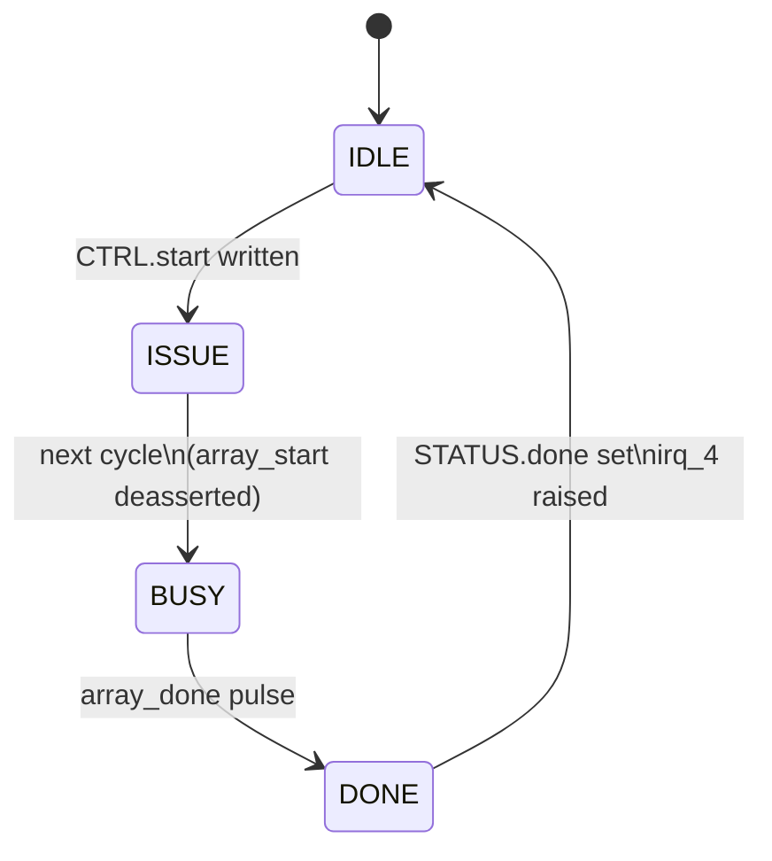

# Control Unit Interface

> The APB-visible register file and the compute-control FSM. Software programs the
> dimensions and presses "start" here; the unit sequences one matrix-multiply tile
> and raises an interrupt when it finishes.

- **Module:** `control_unit`
- **Source:** [`rtl/control/control_unit.sv`](../../rtl/control/control_unit.sv)
- **Owner:** Li (#1)

## Overview

`control_unit` exposes the accelerator's register file over a 32-bit APB
subordinate port and drives the FSM that runs one output-stationary tile. The
matrix buffers stream autonomously, so the control unit only issues start/clear
pulses and tracks completion — it never addresses matrix memory directly. It
also exposes build/status and lightweight performance counters so firmware can
observe how a run behaved. `M_DIM`, `N_DIM`, and `K_DIM` are real runtime tile
dimensions: they select a compact tile up to the physical build shape.

## Block diagram

## Parameters

| Parameter | Default | Description |
| --- | --- | --- |
| `DATA_W` | `8` | Build-time Matrix A/B element width, exposed through `BUILD_INFO`. |
| `M` | `16` | Build-time physical array rows, exposed through `BUILD_INFO` and default `M_DIM`. |
| `N` | `16` | Build-time physical array columns, exposed through `BUILD_INFO` and default `N_DIM`. |
| `K` | `16` | Build-time reduction depth, exposed through `BUILD_INFO` and default `K_DIM`. |
| `APB_AW` | `10` | APB address width. |
| `APB_DW` | `32` | APB data width. |

## Ports

### System & APB

| Port | Direction | Width | Description |
| --- | --- | --- | --- |
| `clk_in` | Input | `1` | System clock. |
| `reset_int` | Input | `1` | Active-high reset from the SoC; converted internally to active-low `rst_n`. |
| `PADDR` | Input | `APB_AW` | APB address; local decode uses `PADDR[7:0]`. |
| `PENABLE` | Input | `1` | APB enable. |
| `PSEL` | Input | `1` | APB select. |
| `PWDATA` | Input | `APB_DW` | APB write data. |
| `PWRITE` | Input | `1` | APB write enable. |
| `PRDATA` | Output | `APB_DW` | APB read data. |
| `PREADY` | Output | `1` | APB ready; permanently asserted in v1. |
| `PSLVERR` | Output | `1` | APB error; permanently deasserted in v1. |
| `irq_en_4` | Input | `1` | SoC interrupt-enable gate. |
| `ss_ctrl_4` | Input | `8` | Reserved SoC subsystem control word. |
| `irq_4` | Output | `1` | Level interrupt on compute-done when enabled. |

### Performance events

These inputs are generated by `accelerator_top` and sampled by the control unit's
counter block. They are not software-controlled signals.

| Port | Direction | Width | Description |
| --- | --- | --- | --- |
| `perf_apb_write` | Input | `1` | One-cycle pulse for each completed top-level APB write transaction. |
| `perf_apb_read` | Input | `1` | One-cycle pulse for each completed top-level APB read transaction. |
| `perf_input_stall` | Input | `1` | High when the array is ready for an input beat but the A/B streamer is not valid. |
| `perf_output_stall` | Input | `1` | High when the array has an output row valid but downstream is not ready. |

### Runtime dimensions

| Port | Direction | Width | Description |
| --- | --- | --- | --- |
| `cfg_m_dim`, `cfg_n_dim`, `cfg_k_dim` | Output | `APB_DW` | Pending runtime dimensions from the APB registers, clamped to `1..M/N/K`; used by the A/B preload path while software writes compact tiles before `start`. |
| `run_m_dim`, `run_n_dim`, `run_k_dim` | Output | `APB_DW` | Dimensions latched on an accepted `start`; used by the array and C capture/readback so a completed tile's result window is stable. |

### Accelerator control

| Port | Direction | Width | Description |
| --- | --- | --- | --- |
| `array_start` | Output | `1` | One-cycle start pulse to the systolic array and A/B streamer. |
| `array_clear` | Output | `1` | One-cycle clear pulse aligned with `array_start`. |
| `array_done` | Input | `1` | One-cycle completion pulse from the systolic array. |

## Register map

The unit decodes registers using `PADDR[7:0]`, so it can sit behind a top-level APB mux.

| Offset | Register | Access | Description |
| --- | --- | --- | --- |
| `0x00` | `CTRL` | R/W | Bit `0`: start pulse request. Bit `1`: soft reset. |
| `0x04` | `STATUS` | R/W1C | Bit `0`: busy. Bit `1`: done (cleared by writing `1` to bit `1`). |
| `0x08` | `M_DIM` | R/W | Runtime M dimension, clamped to `1..physical M`, default `16`. Writes while busy are ignored. |
| `0x0C` | `N_DIM` | R/W | Runtime N dimension, clamped to `1..physical N`, default `16`. Writes while busy are ignored. |
| `0x10` | `INT_EN` | R/W | Bit `0`: done-interrupt enable. |
| `0x14` | `INT_STAT` | R/W1C | Bit `0`: done-interrupt pending. |
| `0x18` | `K_DIM` | R/W | Runtime K reduction dimension, clamped to `1..physical K`, default `16`. Writes while busy are ignored. |
| `0x1C` | `BUILD_INFO` | R/O | Build-time geometry: bits `[7:0]=M`, `[15:8]=N`, `[23:16]=K`, `[31:24]=DATA_W`. |
| `0x20` | `HW_STATUS` | R/O | Bit `0`: performance counters active. Bit `1`: input stall seen. Bit `2`: output stall seen. Bit `3`: counter overflow seen. Bits `[9:8]`: control FSM state. |
| `0x24` | `PERF_CTRL` | W/O | Bit `0`: clear performance counters and sticky status bits. Reads return zero. |
| `0x28` | `PERF_CYCLES` | R/O | Compute-cycle counter. Counts cycles between accepted start and array done. |
| `0x2C` | `PERF_APB_WRITES` | R/O | Number of completed top-level APB write transactions since last performance clear. |
| `0x30` | `PERF_APB_READS` | R/O | Number of completed top-level APB read transactions since last performance clear. |
| `0x34` | `PERF_IN_STALLS` | R/O | Number of compute cycles where input was requested but not valid. |
| `0x38` | `PERF_OUT_STALLS` | R/O | Number of compute cycles where output was valid but not accepted. |

## Behavior

### Control FSM

- **`IDLE`** — wait for a software start request.
- **`ISSUE`** — assert `array_start` and `array_clear` for one cycle.
- **`BUSY`** — wait for `array_done` from the array.
- **`DONE`** — set `STATUS.done` and `INT_STAT.done`, then return to `IDLE`.

### Runtime tile layout

For a runtime tile `(m, n, k) = (M_DIM, N_DIM, K_DIM)`, software writes compact
row-major tiles:

- A has `m*k` elements, with `A[i,k] -> i*K_DIM + k`.
- B has `k*n` elements, with `B[k,j] -> k*N_DIM + j`.
- C reads back `m*n` elements, with `C[i,j] -> i*N_DIM + j`.

The physical array lanes outside `m` rows or `n` columns are zero-masked. The
dimension registers are latched on accepted start, so result readback remains
stable even after the FSM returns to idle.

## Notes

- `soft_reset` clears the compute FSM and the status/interrupt state but leaves the configuration registers intact.
- Writing `PERF_CTRL[0]=1` clears only the performance counters and sticky
   performance status bits. A compute start clears `PERF_CYCLES`,
   `PERF_IN_STALLS`, and `PERF_OUT_STALLS` for the new run, but leaves APB
   read/write counters intact so software can measure the full transaction window.
- `irq_4` is level-sensitive: `irq_en_4 && INT_EN.done && INT_STAT.done`.
