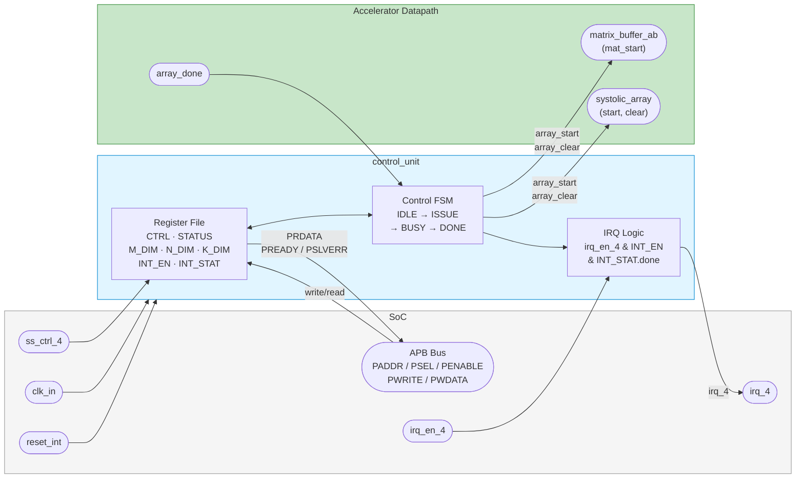
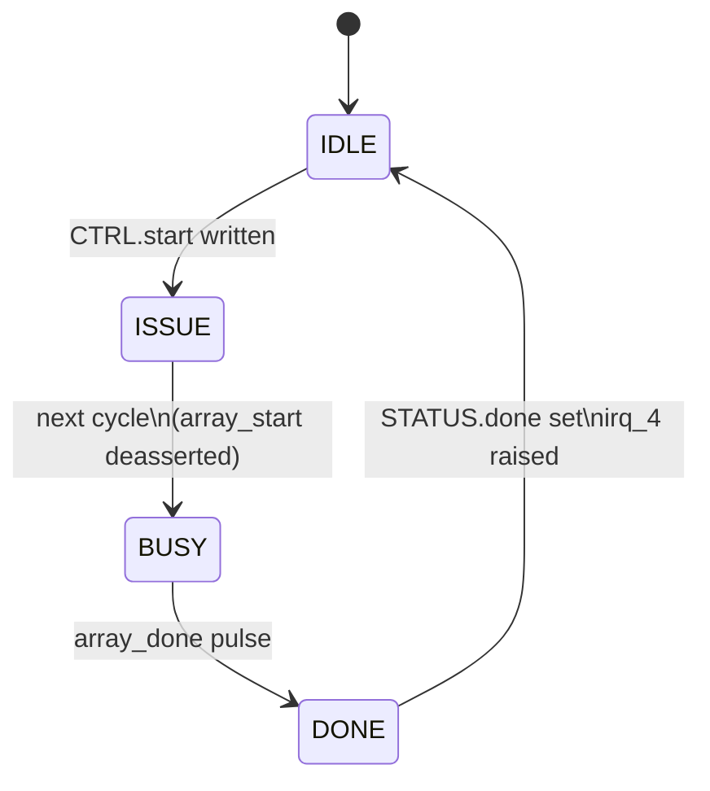

# Control Unit Interface

> The APB-visible register file and the compute-control FSM. Software programs the
> dimensions and presses "start" here; the unit sequences one matrix-multiply tile
> and raises an interrupt when it finishes.

- **Module:** `control_unit`
- **Source:** [`rtl/control/control_unit.sv`](../../rtl/control/control_unit.sv)
- **Owner:** Li (#1)

## Overview

`control_unit` exposes the accelerator's register file over a 32-bit APB
subordinate port and drives the FSM that runs one output-stationary tile. The
matrix buffers stream autonomously, so the control unit only issues start/clear
pulses and tracks completion — it never addresses matrix memory directly.

## Block diagram

## Parameters

| Parameter | Default | Description |
| --- | --- | --- |
| `APB_AW` | `10` | APB address width. |
| `APB_DW` | `32` | APB data width. |

## Ports

### System & APB

| Port | Direction | Width | Description |
| --- | --- | --- | --- |
| `clk_in` | Input | `1` | System clock. |
| `reset_int` | Input | `1` | Active-high reset from the SoC; converted internally to active-low `rst_n`. |
| `PADDR` | Input | `APB_AW` | APB address; local decode uses `PADDR[7:0]`. |
| `PENABLE` | Input | `1` | APB enable. |
| `PSEL` | Input | `1` | APB select. |
| `PWDATA` | Input | `APB_DW` | APB write data. |
| `PWRITE` | Input | `1` | APB write enable. |
| `PRDATA` | Output | `APB_DW` | APB read data. |
| `PREADY` | Output | `1` | APB ready; permanently asserted in v1. |
| `PSLVERR` | Output | `1` | APB error; permanently deasserted in v1. |
| `irq_en_4` | Input | `1` | SoC interrupt-enable gate. |
| `ss_ctrl_4` | Input | `8` | Reserved SoC subsystem control word. |
| `irq_4` | Output | `1` | Level interrupt on compute-done when enabled. |

### Accelerator control

| Port | Direction | Width | Description |
| --- | --- | --- | --- |
| `array_start` | Output | `1` | One-cycle start pulse to the systolic array and A/B streamer. |
| `array_clear` | Output | `1` | One-cycle clear pulse aligned with `array_start`. |
| `array_done` | Input | `1` | One-cycle completion pulse from the systolic array. |

## Register map

The unit decodes registers using `PADDR[7:0]`, so it can sit behind a top-level APB mux.

| Offset | Register | Access | Description |
| --- | --- | --- | --- |
| `0x00` | `CTRL` | R/W | Bit `0`: start pulse request. Bit `1`: soft reset. |
| `0x04` | `STATUS` | R/W1C | Bit `0`: busy. Bit `1`: done (cleared by writing `1` to bit `1`). |
| `0x08` | `M_DIM` | R/W | M dimension, default `16`. |
| `0x0C` | `N_DIM` | R/W | N dimension, default `16`. |
| `0x10` | `INT_EN` | R/W | Bit `0`: done-interrupt enable. |
| `0x14` | `INT_STAT` | R/W1C | Bit `0`: done-interrupt pending. |
| `0x18` | `K_DIM` | R/W | K reduction dimension, default `16`. |

## Behavior

### Control FSM

- **`IDLE`** — wait for a software start request.
- **`ISSUE`** — assert `array_start` and `array_clear` for one cycle.
- **`BUSY`** — wait for `array_done` from the array.
- **`DONE`** — set `STATUS.done` and `INT_STAT.done`, then return to `IDLE`.

## Notes

- `soft_reset` clears the compute FSM and the status/interrupt state but leaves the configuration registers intact.
- `irq_4` is level-sensitive: `irq_en_4 && INT_EN.done && INT_STAT.done`.
