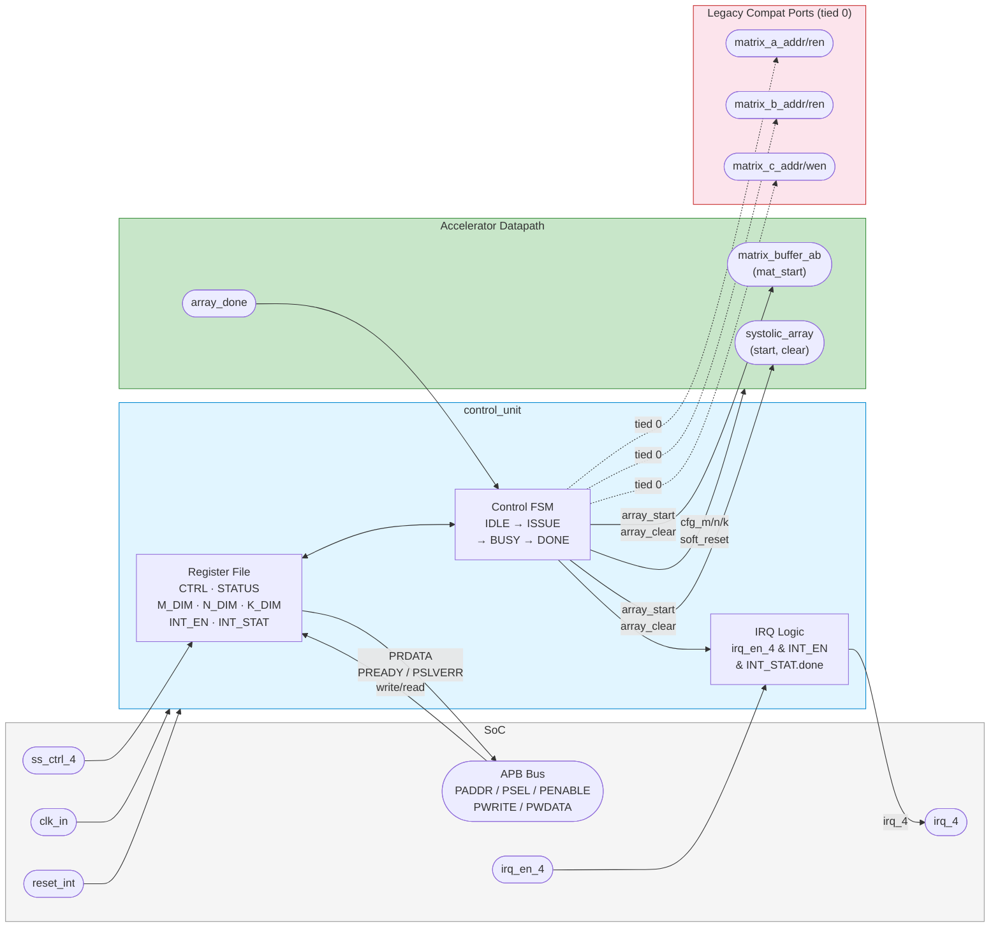
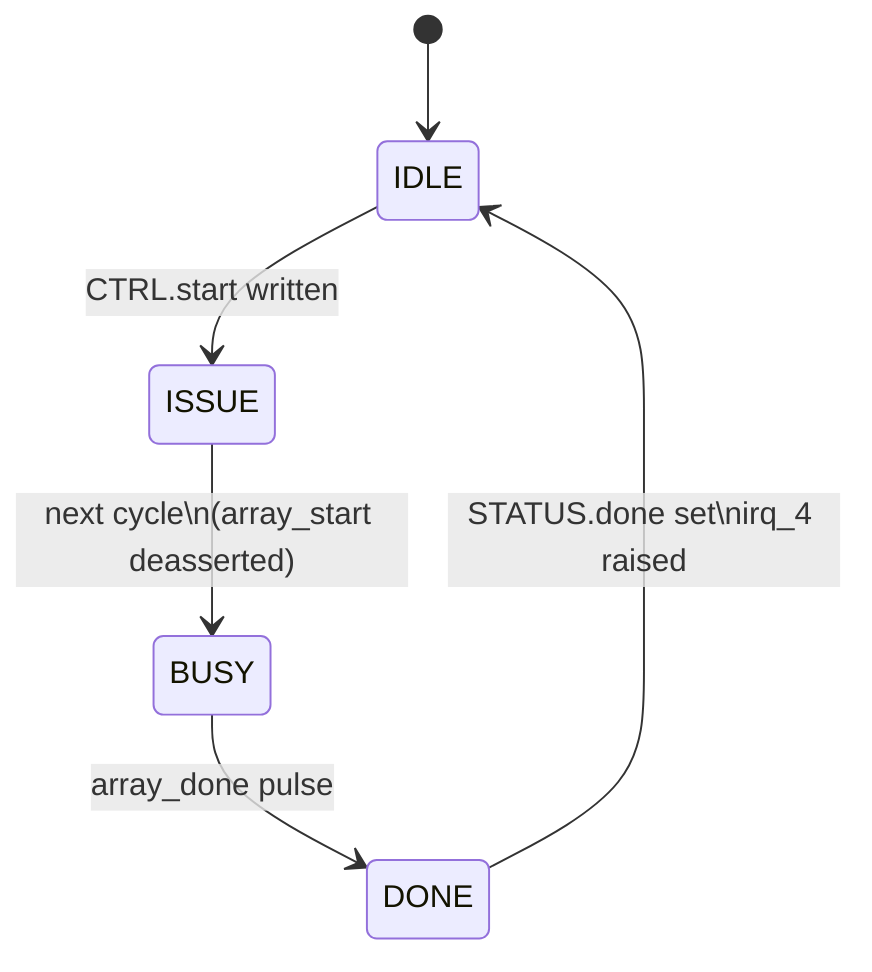

# Control Unit Interface Declarations

### Module Name
`control_unit`

### Block Diagram

### Description
The control unit provides the APB-visible register file for the accelerator and drives the compute-control FSM for one output-stationary matrix-multiply tile. In v1, the matrix buffers stream autonomously, so the legacy matrix address ports are preserved only for interface compatibility and are tied low in RTL.

### Parameters

| Parameter Name | Default Value | Description |
| --- | --- | --- |
| `APB_AW` | `10` | APB address width |
| `APB_DW` | `32` | APB data width |

### Ports

#### System & APB Interface

| Port Name | Direction | Width | Description |
| --- | --- | --- | --- |
| `clk_in` | Input | `1` | System clock |
| `reset_int` | Input | `1` | Active-high reset from the SoC; converted internally to active-low `rst_n` |
| `PADDR` | Input | `APB_AW` | APB address |
| `PENABLE` | Input | `1` | APB enable |
| `PSEL` | Input | `1` | APB select |
| `PWDATA` | Input | `APB_DW` | APB write data |
| `PWRITE` | Input | `1` | APB write enable |
| `PRDATA` | Output | `APB_DW` | APB read data |
| `PREADY` | Output | `1` | APB ready, permanently asserted in v1 |
| `PSLVERR` | Output | `1` | APB error, permanently deasserted in v1 |
| `irq_en_4` | Input | `1` | SoC interrupt enable gate |
| `ss_ctrl_4` | Input | `8` | Reserved SoC subsystem control word |
| `irq_4` | Output | `1` | Level interrupt on compute done when enabled |

#### Accelerator Control / Compatibility Ports

| Port Name | Direction | Width | Description |
| --- | --- | --- | --- |
| `matrix_a_addr` | Output | `MATRIX_AW` | Legacy Matrix A address port; tied to `0` in v1 |
| `matrix_a_ren` | Output | `1` | Legacy Matrix A read enable; tied to `0` in v1 |
| `matrix_b_addr` | Output | `MATRIX_AW` | Legacy Matrix B address port; tied to `0` in v1 |
| `matrix_b_ren` | Output | `1` | Legacy Matrix B read enable; tied to `0` in v1 |
| `matrix_c_addr` | Output | `MATRIX_AW` | Legacy Matrix C address port; tied to `0` in v1 |
| `matrix_c_wen` | Output | `1` | Legacy Matrix C write enable; tied to `0` in v1 |
| `array_start` | Output | `1` | One-cycle start pulse to the systolic array and A/B buffer streamer |
| `array_clear` | Output | `1` | One-cycle clear pulse aligned with `array_start` |
| `array_done` | Input | `1` | One-cycle completion pulse from the systolic array |
| `cfg_m_dim` | Output | `APB_DW` | Exposed M dimension register value |
| `cfg_n_dim` | Output | `APB_DW` | Exposed N dimension register value |
| `cfg_k_dim` | Output | `APB_DW` | Exposed K dimension register value |
| `soft_reset` | Output | `1` | Current software soft-reset bit state |

### Register Map

The unit decodes registers using `PADDR[7:0]`, so it can sit behind a top-level APB mux.

| Offset | Register Name | R/W | Description |
| --- | --- | --- | --- |
| `0x00` | `CTRL` | R/W | Bit `0`: start pulse request, bit `1`: soft reset |
| `0x04` | `STATUS` | R/W1C | Bit `0`: busy, bit `1`: done; done is cleared by writing `1` to bit `1` |
| `0x08` | `M_DIM` | R/W | M dimension register, default `4` |
| `0x0C` | `N_DIM` | R/W | N dimension register, default `4` |
| `0x10` | `INT_EN` | R/W | Bit `0`: done interrupt enable |
| `0x14` | `INT_STAT` | R/W1C | Bit `0`: done interrupt pending |
| `0x18` | `K_DIM` | R/W | K reduction dimension register, default `4` |

### Control FSM

- `IDLE`: wait for a software start request.
- `ISSUE`: assert `array_start` and `array_clear` for one cycle.
- `BUSY`: wait for `array_done` from the array.
- `DONE`: set `STATUS.done` and `INT_STAT.done`, then return to `IDLE`.

### Notes

- `soft_reset` clears the internal compute FSM and status/interrupt state, but leaves the configuration registers intact.
- `irq_4` is level-sensitive: `irq_en_4 && INT_EN.done && INT_STAT.done`.
