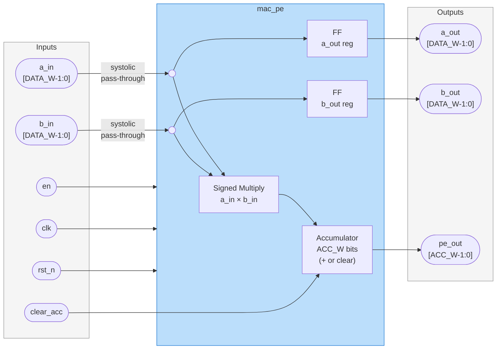

# MAC (Multiply Accumulate) Interface declarations 

### Module name
`mac_pe`
### block diagram

                         +---------------------------+
            b_in =======>|                           |=======> b_out
                         |          mac_pe           |
            a_in =======>|   (Processing Element)    |=======> a_out
                         |                           |
        clear_acc ------>|                           |=======> pe_out
                         +---------------------------+
                                ^       ^       ^
                                |       |       |
                               clk    rst_n     en

### Parameters
- `DATA_W` (default 16): Bit-width for signed input data and weights.
- `ACC_W` (default 32): Bit-width for the internal accumulator to prevent overflow ($2 \times DATA\_W$).

### Clock/Reset
- `clk`: System clock.
- `rst_n`: Active-low synchronous reset.

### Control and Handshake
- `en`: Clock enable signal. The PE performs multiplication, accumulation, and data shifting only when `en` is high.
- `clear_acc`: Synchronous clear signal. When asserted, the internal accumulator is reset to zero or initialized with the current product ($A \times B$).

### Data Inputs
- `a_in[DATA_W-1:0]`: Signed data element from the left neighbor or Matrix A stream.
- `b_in[DATA_W-1:0]`: Signed data element from the top neighbor or Matrix B stream.

### Data Outputs
- `a_out[DATA_W-1:0]`: Registered version of `a_in`. It passes the input to the right neighbor on the next `clk` edge.
- `b_out[DATA_W-1:0]`: Registered version of `b_in`. It passes the input to the bottom neighbor on the next `clk` edge.
- `pe_out[ACC_W-1:0]`: The current signed 32-bit accumulation result held within this PE.

### Logic Notes
- **Signed Arithmetic**: All calculations (multiplication and addition) must be performed using signed logic.

- **Formula**:
$$Accumulator = (a\_in \times b\_in) + Accumulator$$

- **Pipelining**: `a_out` and `b_out` must be driven by flip-flops to ensure the systolic "pulse" behavior across the array.

- **Overflow**: The internal accumulator `ACC_W` is sized to 32 bits to ensure no precision is lost during the summation of 16-bit products.

