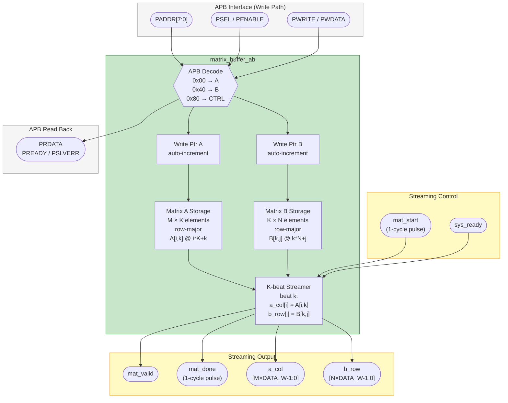

# Matrix A &amp; B Buffer Interface

> The input staging buffers. Software writes Matrix A and Matrix B over APB; on a
> start pulse the buffer streams one A column and one B row per beat into the
> systolic array.

- **Module:** `matrix_buffer_ab`
- **Source:** [`rtl/matrix/matrix_buffer_ab.sv`](../../rtl/matrix/matrix_buffer_ab.sv)
- **Owner:** Cao (#4)

## Overview

`matrix_buffer_ab` stores Matrix A and Matrix B behind a 32-bit APB subordinate
port, then streams one A column and one B row per accepted beat into the
output-stationary systolic array. Geometry is fixed per build (`M`, `N`, `K`), and
matrices are stored row-major:

- `A[i,k]` at linear offset `i*K + k`
- `B[k,j]` at linear offset `k*N + j`

## Block diagram

## Parameters

| Parameter | Default | Description |
| --- | --- | --- |
| `DATA_W` | `16` | Element bit-width. The unpacking logic supports any width that divides 32 evenly; verification uses `16`. |
| `M` | `4` | Output rows / A rows. |
| `N` | `4` | Output columns / B columns. |
| `K` | `4` | Reduction dimension (stream beats per tile). |
| `APB_AW` | `10` | APB address width. |
| `APB_DW` | `32` | APB data width. |

## Ports

### APB

| Port | Direction | Width | Description |
| --- | --- | --- | --- |
| `clk` | Input | `1` | System clock. |
| `rst_n` | Input | `1` | Active-low synchronous reset. |
| `PADDR` | Input | `APB_AW` | APB address; local decode uses `PADDR[7:0]`. |
| `PSEL` | Input | `1` | APB select. |
| `PENABLE` | Input | `1` | APB enable. |
| `PWRITE` | Input | `1` | APB write enable. |
| `PWDATA` | Input | `APB_DW` | APB write data. |
| `PRDATA` | Output | `APB_DW` | APB read data. |
| `PREADY` | Output | `1` | Always asserted (zero-wait). |
| `PSLVERR` | Output | `1` | Asserted on an A/B write when the target bank write pointer is already at capacity (overflow); deasserted otherwise. |

### Streaming

| Port | Direction | Width | Description |
| --- | --- | --- | --- |
| `mat_start` | Input | `1` | One-cycle pulse that starts a K-beat stream. |
| `mat_done` | Output | `1` | One-cycle pulse after the last beat is accepted. |
| `mat_valid` | Output | `1` | Stream beat valid. |
| `sys_ready` | Input | `1` | Systolic array ready to consume a beat. |
| `a_col` | Output | `M*DATA_W` | Packed A column for the current `k`. |
| `b_row` | Output | `N*DATA_W` | Packed B row for the current `k`. |

## Register map

| Offset | Register | Access | Description |
| --- | --- | --- | --- |
| `0x00` | `MAT_A_DATA` | W/O | Write packed Matrix A elements; write pointer auto-increments. |
| `0x40` | `MAT_B_DATA` | W/O | Write packed Matrix B elements; write pointer auto-increments. |
| `0x80` | `MAT_CTRL` | R/W | Bit `0`: reset both write pointers. Read bit `1`: A full. Read bit `2`: B full. |

APB access rules:

- **Overflow protection.** Writes beyond capacity (`M*K` for A, `K*N` for B) are safely ignored.
- **Write-only reads.** Reading `0x00` or `0x40` does not raise a slave error; it returns `0x00000000`.
- **Transient reset.** Writing `1` to `MAT_CTRL[0]` resets the pointers in the same cycle and self-clears, so software need not write `0` back.

## Behavior

### Data packing

The APB bus is 32 bits wide; elements are packed least-significant-lane first.

| `DATA_W` | Elements per write |
| --- | --- |
| `8` | 4 |
| `16` | 2 |
| `32` | 1 |

Example for `DATA_W = 16`: `PWDATA = (el_1 << 16) | el_0`.

### Streaming

- Software writes A and B in row-major order.
- On `mat_start`, the buffer begins a `K`-beat stream.
- Beat `k` drives `a_col[i] = A[i,k]` (`i = 0..M-1`) and `b_row[j] = B[k,j]` (`j = 0..N-1`).
- A beat is consumed only when `mat_valid && sys_ready`.

## Notes

- Storage geometry is fixed at build time by `M`, `N`, and `K`.
