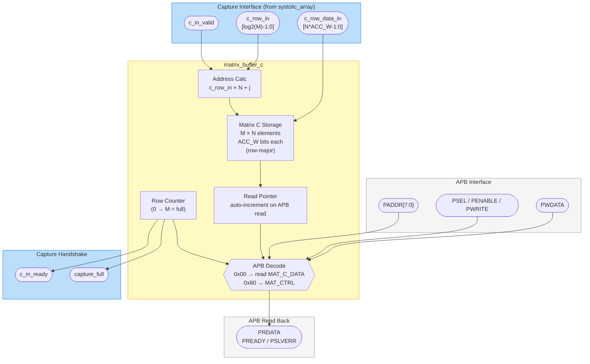

# Matrix C Buffer Interface

> The output capture buffer. It catches each C row drained by the systolic array,
> stores the result matrix row-major, and hands it back to software over APB.

- **Module:** `matrix_buffer_c`
- **Source:** [`rtl/matrix/matrix_buffer_c.sv`](../../rtl/matrix/matrix_buffer_c.sv)
- **Owner:** Shang (#5)

## Overview

`matrix_buffer_c` captures the drained outputs of the systolic array and stores
them row-major for software read-back over APB. The array drains a full C row per
beat: each accepted beat carries a row index `c_row_in` and a packed row
`c_row_data_in` (N accumulators, column 0 in the low bits). All N columns of that
row are written to linear addresses `c_row_in * N + j` (`j = 0..N-1`) in one cycle.

## Block diagram

## Parameters

| Parameter | Default | Description |
| --- | --- | --- |
| `ACC_W` | `32` | Captured accumulator width. |
| `M` | `4` | Output rows. |
| `N` | `4` | Output columns. |
| `APB_AW` | `10` | APB address width. |
| `APB_DW` | `32` | APB data width. |

## Ports

### APB

| Port | Direction | Width | Description |
| --- | --- | --- | --- |
| `clk` | Input | `1` | System clock. |
| `rst_n` | Input | `1` | Active-low synchronous reset. |
| `PADDR` | Input | `APB_AW` | APB address; local decode uses `PADDR[7:0]`. |
| `PSEL` | Input | `1` | APB select. |
| `PENABLE` | Input | `1` | APB enable. |
| `PWRITE` | Input | `1` | APB write enable. |
| `PWDATA` | Input | `APB_DW` | APB write data. |
| `PRDATA` | Output | `APB_DW` | APB read data. |
| `PREADY` | Output | `1` | Always asserted (zero-wait). |
| `PSLVERR` | Output | `1` | Asserted on a data read once the read pointer has passed the captured C window (over-read); deasserted otherwise. |

### Capture

| Port | Direction | Width | Description |
| --- | --- | --- | --- |
| `c_in_valid` | Input | `1` | Incoming C row valid. |
| `c_in_ready` | Output | `1` | Capture ready; deasserts once all M rows are captured. |
| `c_row_data_in` | Input | `N*ACC_W` | Packed C row (N accumulators, column 0 in the low bits). |
| `c_row_in` | Input | `$clog2(max(M,2))` | Row index of `c_row_data_in`. |
| `capture_full` | Output | `1` | High once all `M` rows have been accepted since the last reset. |

## Register map

| Offset | Register | Access | Description |
| --- | --- | --- | --- |
| `0x00` | `MAT_C_DATA` | R/O | Read the next stored C element; read pointer auto-increments. |
| `0x80` | `MAT_CTRL` | R/W | Bit `0`: reset capture count and read pointer. Read bit `1`: `capture_full`. |

## Behavior

- Storage is row-major: `C[i,j]` reads back in the order `(0,0)`, `(0,1)`, …, `(M-1,N-1)`.
- `c_in_ready` stays high until all `M` rows have been accepted.
- Reading `MAT_C_DATA` returns the low `APB_DW` bits of the stored `ACC_W` value.

## Notes

- A full C row is written in a single cycle (all N columns at once).
