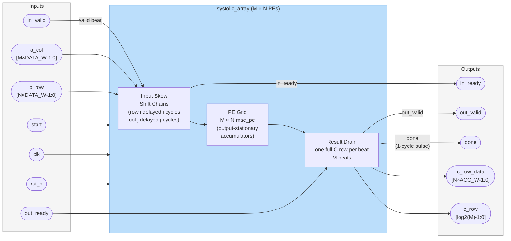

# Systolic Array Interface

> The compute core: an M×N grid of MAC processing elements that consumes streamed
> A columns and B rows, accumulates each `C[i,j]` in place (output-stationary), and
> drains the result one full row per beat.

- **Module:** `systolic_array`
- **Source:** [`rtl/array/systolic_array.sv`](../../rtl/array/systolic_array.sv)
- **Owner:** Zhong (#3)

## Overview

`systolic_array` instantiates an M×N grid of [`mac_pe`](mac_if.md) cells. Matrix A
and Matrix B are streamed in lockstep, one `(a_col, b_row)` pair per accepted beat.
Internal skew chains delay row `i` by `i` cycles and column `j` by `j` cycles so the
operands meet at the right PE at the right time. Each PE accumulates over `K` valid
beats, then the array drains the result one C row per beat, top row first.

## Block diagram

## Parameters

| Parameter | Default | Description |
| --- | --- | --- |
| `DATA_W` | `16` | Signed data/weight bit-width. |
| `ACC_W` | `32` | Accumulator / output width. |
| `M` | `4` | Output rows (A rows). |
| `N` | `4` | Output columns (B columns). |
| `K` | `4` | Reduction dimension (number of stream beats per tile). |

## Ports

### Clock & reset

| Port | Direction | Width | Description |
| --- | --- | --- | --- |
| `clk` | Input | `1` | System clock. |
| `rst_n` | Input | `1` | Active-low synchronous reset. |

### Control & handshake

| Port | Direction | Width | Description |
| --- | --- | --- | --- |
| `start` | Input | `1` | Pulse that launches one M×N output tile. Sampled in `IDLE`. |
| `in_valid` | Input | `1` | Input beat valid this cycle. |
| `in_ready` | Output | `1` | Array can accept an input beat this cycle. |
| `out_valid` | Output | `1` | Output row valid this cycle. |
| `out_ready` | Input | `1` | Downstream can accept the output row this cycle. |
| `done` | Output | `1` | One-cycle pulse after the last C row is accepted. |

### Data

| Port | Direction | Width | Description |
| --- | --- | --- | --- |
| `a_col` | Input | `M*DATA_W` | Packed signed A column for the current `k`. |
| `b_row` | Input | `N*DATA_W` | Packed signed B row for the current `k`. |
| `c_row_data` | Output | `N*ACC_W` | Packed signed C row (column 0 in the low bits, column `N-1` in the high bits). |
| `c_row` | Output | `$clog2(M)` | Row index of `c_row_data`. |

## Behavior

### Output-stationary dataflow

- Each PE owns one `C[i,j]` accumulator.
- One input beat supplies the whole A column `A[:,k]` and the whole B row `B[k,:]`.
- Skew shift chains delay row `i` by `i` cycles and column `j` by `j` cycles.
- Each PE accumulates over exactly `K` valid windows, then the array drains results one row per beat, top to bottom.
- The compute phase lasts `M + N + K − 2` internal pipeline cycles before drain starts.

### Handshake & timing

- A beat is consumed only when `in_valid && in_ready`; A and B are consumed together.
- `in_valid` / `out_valid` may stay high across cycles; if the matching `*_ready` is low, the data is stalled and must be held stable.
- One output row (N elements) is produced per ready cycle after the pipeline latency.
- `done` asserts for one cycle after the last C row is accepted.

## Notes

- C drains in row-major order.
- Drain index decoding assumes `M` and `N` are powers of two.
- Assumes the A/B buffer provides one aligned `(a_col, b_row)` pair per accepted beat.
